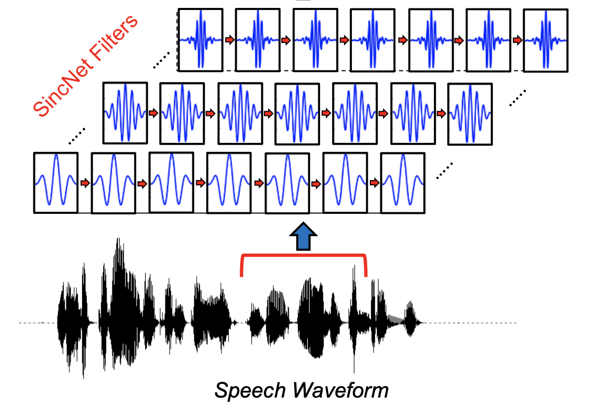

# About This Repository

***
This repository is for those who want to study Speech tasks such as Speech Recognition, Speecn Synthesis, Spoken Language Understanding and so on. <br>
I did not try to survey as many papers as possible but the most crucial papers (especially recently published papers) by my standards.
***

***
*For Koreans)* <br>
이 페이지는 음성 관련 task (음성 인식, 음성 합성  등)를 공부 및 연구하고 싶은 newbie들을 위해 만들어졌습니다. <br>
최대한 페이퍼를 많이 포함하기 보다는 중요하고(citation이 충분히 높고, 신뢰할 만한 기관에서 수행했다거나 등등)
가능한 최신자 페이퍼들을 포함하려고 합니다. (주관적일 수 있음) 
***


# Index
- 1.End-to-End Speech Recognition
  - CTC-based ASR model
  - Seq2Seq with Attention based ASR model
  - CTC & Attention Hybrid ASR model
  - RNN-T based ASR model
  - Streaming ASR model
  
- 2.End-to-End Speech Synthesis

- 3.End-to-End Non-Autoregressive Sequence Generation 
  - ASR
  - NMT
  - TTS

- 4.End-to-End Spoken Language Understanding 
  - Intent Classification (IC) + (Named Entity Recognition (NER) or Slot Filling (SF))
  - Spoken Question Answering (SQA)
  - Speech Emotion Recognition (SER)

- 5.Learnable Front-End for Speech 

- 6.Self-Supervised(or Semi-Supervised) Learning for Speech

- 7.Some Trivial Schemes for Speech Tasks


- TBC
  - Voice Conversion
  - Speaker Identification
  - MIR ?
  - Rescoring
  - Speech Translation


<br>

***

<br>

# 1. End-to-End Speech Recognition 

I recommend you to read graves' thesis : [Supervised Sequence Labelling with Recurrent Neural Networks, 2008](https://www.cs.toronto.edu/~graves/preprint.pdf)

## **1.1 CTC based ASR model**
- If you're new to CTC-based ASR model, you'd better see this blog before reading papers : [post for CTC from Distill blog](https://distill.pub/2017/ctc/)
  - additional : **For Korean : [link1](https://m.blog.naver.com/PostView.nhn?blogId=sogangori&logNo=221183469708&proxyReferer=https:%2F%2Fwww.google.com%2F), [link2](https://ratsgo.github.io/speechbook/docs/neuralam/ctc)**

```
음성인식(Automatic Speech Recognition), 활자인식(Optical Character Recognition, OCR) 등의 task의 주요 문제점 중 하나는
바로 정렬(alignment) 문제입니다.
이는 음성인식을 예로 들자면, 음성(입력 데이터) 와 이에 대응하는 문장(맞춰야할 정답)의 sequence길이가 서로 다르기 떄문에
어디서 부터 어디까지가 토큰(단어, 문자)에 매핑되는지 알 수 없는 문제를 이야기합니다.

2006년 Alex Graves에 의해 제안된 Connectionist Temporal Classification 논문에서 
제안된 CTC loss는 바로 이를 해결하기 위해 제안된 방법 이며,
이는 음성인식에서 1.2 section의 Attention 을 활용한 Seq2Seq 기법과 쌍벽을 이루는 기법입니다.
```

<p align="center"></p>
<p align="center">Fig. Deep Speech 2 : End-to-End Speech Recognition in English and Mandarin</p> <br>
  
|year|conference|research organization|title|model|link|code|
|--|--|--|------|---|--|--|
|2006|ICML|University of Toronto|**Connectionist Temporal Classification: Labelling Unsegmented Sequence Data with Recurrent Neural Networks**|CTC|[paper](https://www.cs.toronto.edu/~graves/icml_2006.pdf)|[code(pytorch),warp-ctc](https://github.com/SeanNaren/warp-ctc),[code(pytorch)](https://github.com/Alexander-H-Liu/End-to-end-ASR-Pytorch)|
|2014|ICML|Deepmind|**Towards End-To-End Speech Recognition with Recurrent Neural Network**|LSTM-based CTC model|[paper](http://proceedings.mlr.press/v32/graves14.pdf)||
|2014||Baidu Research|Deep speech: Scaling up end-to-end speech recognition||[paper](https://arxiv.org/pdf/1412.5567)|[code(tensorflow)](https://github.com/mozilla/DeepSpeech),[code(pytorch)](https://github.com/MyrtleSoftware/deepspeech)|
|2016|ICML|Baidu Research|**Deep Speech 2 : End-to-End Speech Recognition in English and Mandarin**|CNN-based CTC model|[paper](https://arxiv.org/pdf/1512.02595)|[code(pytorch)](https://github.com/SeanNaren/deepspeech.pytorch)|
|2016||Facebook AI Research (FAIR)|**Wav2Letter: an End-to-End ConvNet-based Speech Recognition System**|CNN-based CTC model|[paper](https://arxiv.org/pdf/1609.03193)|[code(official pytorch, C++)](https://github.com/facebookresearch/wav2letter)|
|2018||Google|STATE-OF-THE-ART SPEECH RECOGNITION WITH SEQUENCE-TO-SEQUENCE MODELS||[paper](https://research.google.com/pubs/archive/46687.pdf)||
|2019|Interspeech|Nvidia|Jasper: An End-to-End Convolutional Neural Acoustic Model|CNN-based CTC model|[paper](https://arxiv.org/pdf/1904.03288)|[code(official)](https://github.com/NVIDIA/OpenSeq2Seq),[code(pytorch)](https://github.com/sooftware/jasper)|
|2019||Nvidia|**Quartznet: Deep automatic speech recognition with 1d time-channel separable convolutions**||[paper](https://arxiv.org/pdf/1910.10261)||

<br>

## **1.2 Seq2Seq with Attention based ASR model**
- If you're new to seq2seq with attention network, you'd better check following things
  - [post for Seq2Seq with Attention Network 1 from lillog](https://lilianweng.github.io/lil-log/2018/06/24/attention-attention.html)
  - [post for Seq2Seq with Attention Network 2 from distill](https://distill.pub/2016/augmented-rnns/)
  - [post for Seq2Seq with Attention Network 3](https://guillaumegenthial.github.io/sequence-to-sequence.html)
  - [post for Transformer from Jay Alammar](http://jalammar.github.io/illustrated-transformer/)

```
Attention 을 활용한 Seq2Seq ASR 네트워크는, 2014년에 제안된 기계번역 분야의 breakthrough 였던
'Neural Machine Translation by Jointly Learning to Align and Translate'논문과 굉장히 유사한 네트워크로,
CTC와 마찬가지로 음성인식에서의 alignment 문제를 획기적으로 해결한 방법입니다.

이는 Auto-regressive하게 디코딩한다는 문제점이 존재하기는 하지만 가장 강력한 성능을 내는 End-to-End 기법 중 하나입니다.

과거 HMM-GMM, HMM-DNN 모델의 음향 모델(Acoustic Model, AM), 언어 모델(Language Model, LM)등의 역할을
Seq2Seq 모델의 인코더(Encoder), 디코더(Decoder)가 한다고 알려져 있습니다.
```
    
<p align="center"></p>
<p align="center"></p>
<p align="center">Fig. Listen, Attend and Spell</p> <br>

|year|conference|research organization|title|model|link|code|
|--|--|--|------|---|--|--|
|2015|NIPS|University of Wrocław, Jacobs University Bremen, Universite ́ de Montre ́al et al.|**Attention-Based Models for Speech Recognition|Seq2Seq with Attention**|[paper](https://arxiv.org/pdf/1506.07503)|[code(pytorch](https://github.com/sooftware/KoSpeech), [code2(pytorch](https://github.com/Alexander-H-Liu/End-to-end-ASR-Pytorch)|
|2015|ICASSP|Google|**Listen, Attend and Spell**|Seq2Seq with Attention|[paper](https://arxiv.org/pdf/1508.01211)|[code(pytorch)](https://github.com/clovaai/ClovaCall)|
|2016|ICASSP|Jacobs University Bremen, University of Wrocław, Universite ́ de Montre ́al, CIFAR Fellow|End-to-End Attention-based Large Vocabulary Speech Recognition|Seq2Seq with Attention|[paper](https://arxiv.org/pdf/1508.04395)||
|2018|ICASSP||**Speech-Transformer: A No-Recurrence Sequence-to-Sequence Model for Speech Recognition**|Seq2Seq with Attention|[paper](https://ieeexplore.ieee.org/document/8462506)|[code(official)](https://github.com/xingchensong/Speech-Transformer-tf2.0),[another ref code](https://github.com/kaituoxu/Speech-Transformer)|
|2019|ASRU||**A Comparative Study on Transformer vs RNN in Speech Applications**|Seq2Seq with Attention|[paper](https://arxiv.org/pdf/1909.06317)||
|2020||Facebook|**End-to-end ASR: from Supervised to Semi-Supervised Learning with Modern Architectures**|Training either CTC or Seq2Seq loss functions|[paper](https://arxiv.org/pdf/1911.08460)||

## **1.3 CTC & Attention Hybrid Model**

```
CTC loss와 Seq2Seq loss를 둘 다 사용하여(jointly) 모델링한 이 네트워크는 
앙상블 효과를 누리는 느낌으로(?) End-to-End 음성인식 네트워크를 학습을 더욱 잘되게 합니다.

보통 CTC loss와 Seq2Seq loss를 합이 1이되게 interporation 하며, 학습 시간이 지날수록 이 비율을 바꾸며(sceheduling) 학습합니다.
```

<p align="center"></p>
<p align="center">Fig. Joint CTC-Attention based End-to-End Speech Recognition using Multi-task Learning</p> <br>

|year|conference|research organization|title|model|link|code|
|--|--|--|------|---|--|--|
|2017|||Hybrid CTC/Attention Architecture for End-to-End Speech Recognition||[paper](https://ieeexplore.ieee.org/document/8068205)||
|2017|||Joint CTC-Attention based End-to-End Speech Recognition using Multi-task Learning||[paper](https://arxiv.org/pdf/1609.06773)|[code(pytorch)](https://github.com/Alexander-H-Liu/End-to-end-ASR-Pytorch)|
|2019|||Transformer-based Acoustic Modeling for Hybrid Speech Recognition||[paper](https://arxiv.org/pdf/1910.09799)||

<br>

## **1.4 RNN-T based ASR model**

- you'd better read this blog article first : [Google AI Blog for RNN-Transducer](https://ai.googleblog.com/2019/03/an-all-neural-on-device-speech.html)

```
RNN-Transducer의 개념은 Alex Graves에 의해서 'Sequence Transduction with Recurrent Neural Networks'라는 제목의 논문으로 
처음 소개되었습니다.

종단간(End-to-End) 음성인식(ASR) 모델들은 그동안 CTC loss나 Seq2seq loss를 활용한 RNN 기반 다양한 모델들이 있었지만,
이들은 모두 실시간(Real-time or Streaming) 음서인식에 적합하지 않았고 이를 해결하기 위해 제안된 개념이 바로 RNN-T입니다.

RNN 네트워크는 물론 최근 NLP뿐 아니라 CV에서도 연일 최고성능(SOTA)을 갈아치우고 있는 Transformer로 대체할 수 있습니다. 
```

<p align="center"></p>
<p align="center">Fig. Neural Transducer</p> <br>

<p align="center"></p>
<p align="center">Fig. Streaming E2E Speech Recognition For Mobile Devices</p> <br>

|year|conference|research organization|title|model|link|code|
|--|--|--|------|---|--|--|
|2012|ICML|University of Toronto|**Sequence Transduction with Recurrent Neural Networks**||[paper](https://arxiv.org/pdf/1211.3711.pdf%20http://arxiv.org/abs/1211.3711.pdf)||
|2015|NIPS|Google Brain, Deepmind, OpenAI|**A Neural Transducer**||[paper](https://arxiv.org/pdf/1511.04868.pdf)||
|2017|ASRU|Google|Exploring Architectures, Data and Units For Streaming End-to-End Speech Recognition with RNN-Transducer||[paper](https://arxiv.org/pdf/1801.00841)||
|2018|ICASSP|Google|**Streaming E2E Speech Recognition For Mobile Devices**||[paper](https://arxiv.org/pdf/1811.06621)||
|2019|ASRU|Microsoft|Improving RNN Transducer Modeling for End-to-End Speech Recognition||[paper](https://www.microsoft.com/en-us/research/uploads/prod/2019/10/RNNT.pdf)||
|2019|Interspeech|Chinese Academy of Sciences et al.|Self-Attention Transducers for End-to-End Speech Recognition||[paper](https://arxiv.org/pdf/1909.13037)||
|2020|ICASSP|Google|**Transformer Transducer: A Streamable Speech Recognition Model With Transformer Encoders And RNN-T Loss**||[paper](https://arxiv.org/pdf/2002.02562)|[code(pytorch)](https://github.com/okkteam/Transformer-Transducer)|
|2020|ICASSP|Google|A Streaming On-Device End-to-End Model Surpassing Server-Side Conventional Model Quality and Latency||||
|2020|Interspeech|Google|ContextNet: Improving Convolutional Neural Networks for Automatic Speech Recognition with Global Context|CNN based RNN-T|[paper](https://arxiv.org/pdf/2005.03191)||
|2020|Interspeech|Google|Conformer: Convolution-augmented Transformer for Speech Recognition||[paper](https://arxiv.org/pdf/2005.08100)|[code(pytorch)](https://github.com/sooftware/conformer), [code2(pytorch)](https://github.com/lucidrains/conformer)|
|2021|ICASSP|Google|FastEmit: Low-latency Streaming ASR with Sequence-level Emission Regularization||[paper](https://arxiv.org/pdf/2010.11148)||
|2021|ICASSP|Facebook AI|Improved Neural Language Model Fusion for Streaming Recurrent Neural Network Transducer||[paper](https://arxiv.org/pdf/2010.13878)||


<br>

## **1.5 Streaming ASR**

```
사실 1.4의 RNN-T가 곧 Straeming ASR을 위해 디자인 되었는데 그게 그거 아니냐 라고 할 수도 있지만,
RNN-T 이외에도, 어텐션 기반 seq2seq모델만으로 하려는 시도가 있었고, seq2seq 와 RNN-T를 합친 모델 등도 있었기 때문에
따로 빼서 서브섹션을 하나 더 만들었습니다.
```

<p align="center"></p>
<p align="center">Fig. Two-Pass End-to-End Speech Recognition</p> <br>

<p align="center"></p>
<p align="center">Fig. Streaming automatic speech recognition with the transformer model</p> <br>

|year|conference|research organization|title|model|link|code|
|--|--|--|------|---|--|--|
|2018|ICLR|Google Brain|**Monotonic Chunkwise Attention**|Seq2Seq with Attention|[paper](https://arxiv.org/pdf/1712.05382)||
|2019||Google|**Two-Pass End-to-End Speech Recognition**|LAS+RNN-T|[paper](https://arxiv.org/pdf/1908.10992)||
|2020||MERL|Streaming automatic speech recognition with the transformer model||[paper](https://arxiv.org/pdf/2001.02674)||
|2020|Interspeech|Google|Parallel Rescoring with Transformer for Streaming On-Device Speech Recognition||[paper](https://www.isca-speech.org/archive/Interspeech_2020/pdfs/2875.pdf)||
|2021|ICLR|Google|Dual-mode ASR: Unify and Improve Streaming ASR with Full-context Modeling||[paper](https://arxiv.org/pdf/2010.06030)||

<br>

## **1.5 ASR Rescoring / Spelling Correction (2-pass decoding)**

```
temporal
```

- This is from [link](https://github.com/SeunghyunSEO/speech-recognition-papers)

|year|conference|research organization|title|model|task|link|code|
|--|--|--|------|---|--|--|--|
|2019|||Automatic Speech Recognition Errors Detection and Correction|||||
|2019|||A Spelling Correction Model For E2E Speech Recognition|||||
|2019|||An Empirical Study Of Efficient ASR Rescoring With Transformers|||||
|2019|||Automatic Spelling Correction with Transformer for CTC-based End-to-End Speech Recognition|||||
|2019|||Correction of Automatic Speech Recognition with Transformer Sequence-To-Sequence Model|||||
|2019|||Effective Sentence Scoring Method Using BERT for Speech Recognition||asr|||
|2019|||Spelling Error Correction with Soft-Masked BERT||nlp|||

 
***

<br>
 
# 2. End-to-End Speech Synthesis 

<p align="center"></p>
<p align="center">Fig. Tacotron: Towards End-to-End Speech Synthesis</p> <br>

<br>

|year|conference|research organization|title|model|link|code|
|--|--|--|------|---|--|--|
|2016||Deepmind|**WaveNet: A Generative Model for Raw Audio**||[paper](https://arxiv.org/pdf/1609.03499)||
|2017|ICLR|-|SampleRNN: An Unconditional End-to-End Neural Audio Generation Model||[paper](https://arxiv.org/pdf/1612.07837)|[code(official)](https://github.com/soroushmehr/sampleRNN_ICLR2017)|
|2017|ICLR|Montreal Univ, CIFAR|Char2Wav: End-to-End Speech Synthesis||[paper](https://openreview.net/pdf?id=B1VWyySKx)||
|2017|PMLR|Baidu Research|Deep Voice: Real-time Neural Text-to-Speech||[paper](http://proceedings.mlr.press/v70/arik17a/arik17a.pdf)||
|2017|NIPS|Baidu Research|Deep Voice 2: Multi-Speaker Neural Text-to-Speech||[paper](https://arxiv.org/pdf/1705.08947)||
|2017||Baidu Research|**Deep Voice 3: Scaling Text-to-Speech with Convolutional Sequence Learning**||[paper](https://arxiv.org/pdf/1710.07654)|[code](https://github.com/r9y9/deepvoice3_pytorch)|
|2017||Google|**Tacotron: Towards End-to-End Speech Synthesis**||[paper](https://arxiv.org/pdf/1703.10135)|[code(tensorflow)](https://github.com/Kyubyong/tacotron), [code(pytorch)](https://github.com/r9y9/tacotron_pytorch)|
|2017|ICML||Emotional End-to-End Neural Speech Synthesizer||||
|2018|ICML||**Towards End-to-End Prosody Transfer for Expressive Speech Synthesis with Tacotron**||||
|2018|ICML||**Style Tokens: Unsupervised Style Modeling, Control and Transfer in End-to-End Speech Synthesis**||||
|2021|ICLR|Google Research|Non-Attentive Tacotron: Robust and Controllable Neural TTS Synthesis Including Unsupervised Duration Modeling||[paper](https://arxiv.org/pdf/2010.04301v1.pdf)||
|2018|||Adversarial Audio Synthesis|GAN|[paper](https://arxiv.org/pdf/1802.04208)|[code(official, tensorflow)](https://github.com/chrisdonahue/wavegan)|
|2019|ICASSP|Nvidia|WaveGlow: a Flow-based Generative Network for Speech Synthesis||[paper](https://arxiv.org/pdf/1811.00002)|[code(official, pytorch)](https://github.com/NVIDIA/waveglow)|
|2019|||Parallel WaveGAN: A fast waveform generation model based on generative adversarial networks with multi-resolution spectrogram||[paper](https://arxiv.org/pdf/1910.11480)||
|2019|NIPS|NVIDIA|FastSpeech: Fast, Robust and Controllable Text to Speech||[paper](https://arxiv.org/pdf/1905.09263)||
|2020|-|NVIDIA|**FastSpeech 2: Fast and High-Quality End-to-End Text to Speech**||[paper](https://arxiv.org/pdf/2006.04558)||
|2020|NIPS|Kakao Enterprise, SNU|Glow-TTS: A Generative Flow for Text-to-Speech via Monotonic Alignment Search||[paper](https://arxiv.org/pdf/2005.11129)||
|2020|ICASSP||Flow-TTS: A Non-Autoregressive Network for Text to Speech Based on Flow||[paper](https://ieeexplore.ieee.org/document/9054484)||
|2019|AAAI||Neural Speech Synthesis with Transformer Network||[paper](https://arxiv.org/pdf/1809.08895)||
|2017|||Parallel WaveNet: Fast High-Fidelity Speech Synthesis||||
|2018||-|WaveGlow: A Flow-based Generative Network for Speech Synthesis||||
|2020|ICASSP||Location-Relative Attention Mechanisms For Robust Long-Form Speech Synthesis||||


***

<br>

# 3. End-to-End Non-Autoregressive Sequence Generation Model

```
일반적인 End-to-End 음성인식 모델의 단점 중 하나인 Autoregressive decoding 방법을 해결하기 위한 기법들이 최근 제안되고 있습니다.
하지만 Non-Autoregressive 음성 인식 모델은 논문이 별로 없기 때문에 기계번역(NMT)/음성인식(STT)/음성합성(STT) 모두 포함하려고 .
```
## **3.1 Non-Autoregressive(NA) NMT**

<p align="center"></p>
<p align="center">Fig. NON-AUTOREGRESSIVE NEURAL MACHINE TRANSLATION</p> <br>
  
<p align="center"></p>
<p align="center">Fig. Latent-Variable Non-Autoregressive Neural Machine Translation with Deterministic Inference Using a Delta Posterior</p> <br>

|year|conference|research organization|title|model|link|code|
|--|--|--|------|---|--|--|
|2018|ICLR|The University of Hong Kong|NON-AUTOREGRESSIVE NEURAL MACHINE TRANSLATION||||
|2020||Google|Non-Autoregressive Machine Translation with Latent Alignments||||
|2020||CMU|FlowSeq: Non-Autoregressive Conditional Sequence Generation with Generative Flow||||
|2020||CMU,Berkeley,Peking University|Fast Structured Decoding for Sequence Models||||
|2019|ACL|-|Non-autoregressive Transformer by Position Learning||||
|2020||-|ENGINE: Energy-Based Inference Networks for Non-Autoregressive Machine Translation||||
|2019||University of Tokyo, FAIR, MILA, NYU|Latent-Variable Non-Autoregressive Neural Machine Translation with Deterministic Inference Using a Delta Posterior||||

<br>

## **3.2 Non-Autoregressive(NA) ASR (STT)**

<p align="center"></p>
<p align="center">Fig. Mask CTC: Non-Autoregressive End-to-End ASR with CTC and Mask Predict</p> <br>
  
<p align="center"></p>
<p align="center">Fig. Spike-Triggered Non-Autoregressive Transformer for End-to-End Speech Recognition</p> <br>

|year|conference|research organization|title|model|link|code|
|--|--|--|------|---|--|--|
|2020|Interspeech|-|Mask CTC: Non-Autoregressive End-to-End ASR with CTC and Mask Predict|CTC-based|||
|2020|Interspeech|-|Spike-Triggered Non-Autoregressive Transformer for End-to-End Speech Recognition|CTC-based|||
|2020||-|A Study of Non-autoregressive Model for Sequence Generation||||

<br>

## **3.3 Non-Autoregressive(NA) Speech Synthesis (TTS)**

|year|conference|research organization|title|model|link|code|
|--|--|--|------|---|--|--|
|2020||Baidu Research|Non-Autoregressive Neural Text-to-Speech||||

<br>

***

<br>

# 4. End-to-End Spoken Language Understanding 
```
Spoken Language Understanding (SLU)는 speech dialog system의 front-end 입니다.

기존의 SLU pipeline은 음성을 입력받아 ASR 네트워크가 텍스트를 출력하고, 
이를 입력으로 받은 Natural Language Understanding (NLU) 네트워크가 감정(emotion)/의도(intent,slot) 등의 semantic information을 추출했습니다.

하지만 이런 pipeline은 치명적인 단점을 가지고 있는데요 바로 ASR 네트워크가 출력한 문장에 에러가 포함되어 있을 수 있고,
이럴 경우 NLU입장에서 이는 이해할 수 없기 때문에 형편없는 결과를 추출할 수 밖에 없다는 것입니다.

End-to-End Spoken Language Understanding (E2E SLU)란 음성을 입력으로 받아 direct로 결과를 출력함으로써
음성인식 네트워크가 가지고 있는 에러율에 구애받지 않고 semantic information을 뽑는 기법으로 최근에 활발히 연구가 진행되고 있는 분야입니다.
```

<p align="center"></p>
<p align="center">( Conventional Pipeline for Spoken Language Understanding ( ASR -> NLU ) )</p> <br>

<p align="center"></p>
<p align="center">( End-to-End Spoken Language Understanding Network )</p> <br>

<p align="center">Fig. Towards End-to-end Spoken Language Understanding</p> <br>


## **4.1 Dataset ( including all speech slu dataset IC/SF/SQA ... )**

```
SLU 분야는 꾸준히 연구되어 오긴 했으나, E2E SLU는 최근에서야 활발히 연구되고 있는 분야입니다. 
그렇기 때문에 입력이 텍스트가 아닌 음성으로 되어있는 (예를 들어, Speech - Intent pair) 데이터가 부족합니다.
따라서 연구를 하실 때 괜찮은 public dataset을 찾기 힘들기 때문에 이와 관련된 데이터들부터 리스트업 해보고자 합니다. 
```

  - Intent Classification (IC) + (Named Entity Recognition (NER) or Slot Filling (SF))
  - Spoken Question Answering (SQA)
  - Speech Emotion Recognition (SER)

|task|dataset name|language|year|conference|title|paper link|dataset link|
|--|---|--|--|--|------|----|----|
|-|SLURP|english|2020|EMNLP|SLURP: A Spoken Language Understanding Resource Package|[paper](https://www.aclweb.org/anthology/2020.emnlp-main.588.pdf)|[dataset](https://github.com/pswietojanski/slurp)|
|IC|Fluent Speech Command(FSC)|english|2019|Interspeech|Speech Model Pre-training for End-to-End Spoken Language Understanding|[paper](https://arxiv.org/pdf/1904.03670)|[dataset](https://github.com/lorenlugosch/end-to-end-SLU)|
|IC|SNIPS|english|2018||Snips Voice Platform: an embedded Spoken Language Understanding system for private-by-design voice interfaces|[paper](https://arxiv.org/pdf/1805.10190)||
|IC|ATIS|english|1999||The atis spoken language sys- tems pilot corpus|[paper](https://www.aclweb.org/anthology/H90-1021.pdf)||
|IC|TOP or Facebook Semantic Parsing System (FSPS)|english|2019||Semantic Parsing for Task Oriented Dialog using Hierarchical Representations|[paper](https://arxiv.org/pdf/1810.07942)||
|SQA|Spoken SQuAD(SSQD)|english|2018|Interspeech|Spoken SQuAD: A Study of Mitigating the Impact of Speech Recognition Errors on Listening Comprehension|[paper](https://arxiv.org/abs/1804.00320)|[dataset](https://github.com/chiahsuan156/Spoken-SQuAD)|
|SQA|Spoken CoQA|english|2020|-|Towards Data Distillation for End-to-end Spoken Conversational Question Answering|[paper](https://arxiv.org/pdf/2010.08923)|[dataset](https://stanfordnlp.github.io/coqa/)|
|SQA|Odsaqa|chinese|20-|-|Odsqa: Open-domain spoken question answering dataset|-|-|
|ER|IEMOCAP|english|2017|-|IEMOCAP: Interactive emotional dyadic motion capture database|[paper](https://ecs.utdallas.edu/research/researchlabs/msp-lab/publications/Busso_2008_5.pdf)|[dataset](https://sail.usc.edu/iemocap/)|
|ER|CMU-MOSEI|english|2018|-|Multimodal Language Analysis in the Wild: CMU-MOSEI Dataset and Interpretable Dynamic Fusion Graph|[paper](https://www.aclweb.org/anthology/P18-1208.pdf)|[dataset](https://github.com/A2Zadeh/CMU-MultimodalSDK)|


<br>

## **4.2 Intent Classification (IC) + (Named Entity Recognition (NER) or Slot Filling (SF))**

|year|conference|research organization|title|model|link|code|
|--|--|--|------|---|--|--|
|2018|ICASSP|Facebook, MILA|Towards End-to-end Spoken Language Understanding||[paper](https://arxiv.org/pdf/1802.08395)||
|2019|Interspeech|MILA,CIFAR|Speech Model Pre-training for End-to-End Spoken Language Understanding||[paper](https://arxiv.org/pdf/1904.03670)|[code(official)](https://github.com/lorenlugosch/end-to-end-SLU)|

<br>

## **4.3 Spoken Question Answering (SQA)**

|year|conference|research organization|title|model|link|code|
|--|--|--|------|---|--|--|
|2018|Interspeech||Spoken SQuAD: A Study of Mitigating the Impact of Speech Recognition Errors on Listening Comprehension|dataset|[paper](https://arxiv.org/abs/1804.00320)|[github](https://github.com/chiahsuan156/Spoken-SQuAD)|

<br>

## **4.4 Speech Emotion Recognition (SER)**

<br>

***

<br>


# 5. Learnable Front-End for Speech

```
일바적은 음성 관련 task의 입력값은 보통 Short Time Fourier Transform과 Mel filter bank등을 이용한 (Mel) 스펙트로그램, MFCC 등 이었습니다.
하지만 최근에 제안된 기법들은(시도는 계속 있어왔음) raw speech signal에서부터 곧바로 feature를 추출하는 방식들이며, 
이는 성능적인 측면에서 우수함을 증명하고 있습니다.
```

<p align="center"></p>
<p align="center">Fig. Conventional Front-End feature, Spectrogram using Short-Time-Fourier-Transform(STFT)</p> <br>


<p align="center"></p>
<p align="center">Fig. Interpretable Convolutional Filters with SincNet, 2018</p> <br>

<p align="center"></p>
<p align="center">Fig. LEAF: A Learnable Frontend for Audio Classification, 2021</p> <br>

|year|conference|research organization|title|link|code|
|--|--|--|------|--|--|
|2013|ASRU|Google|Learning filter banks within a deep neural network framework|[paper](https://ieeexplore.ieee.org/document/6707746)||
|2015|Interspeech|Google|Learning the Speech Front-end With Raw Waveform CLDNNs|[paper](https://research.google.com/pubs/archive/43960.pdf)||
|2015|ICASSP|Hebrew University of Jerusalem, Google|Speech acoustic modeling from raw multichannel waveforms|[paper](https://ieeexplore.ieee.org/document/7178847)||
|2018|ICASSP|Facebook AI Research (FAIR), CoML|Learning Filterbanks from Raw Speech for Phone Recognition|[paper](https://arxiv.org/pdf/1711.01161)|[code(pytorch, official)](https://github.com/facebookresearch/tdfbanks)|
|2018||MILA|Interpretable Convolutional Filters with SincNet|[paper](https://arxiv.org/pdf/1811.09725)|[code(official)](https://github.com/mravanelli/SincNet)|
|2021|ICLR|Google|LEAF: A Learnable Frontend for Audio Classification|[paper](https://arxiv.org/pdf/2101.08596)||


# 6. Self-Supervised(or Semi-Supervised) Learning for Speech 
```
Self-Supervised(or Semi-Supervised) Learning 이란 Yann Lecun이 강조했을 만큼 현재 2020년 현재 딥러닝에서 가장 핫 한 주제중 하나이며, 
Label되지 않은 방대한 data를 self-supervised (or semi-supervised) 방법으로 학습하여 입력으로부터 더 좋은 Representation을 찾는 방법입니다. 
이렇게 사전 학습(pre-training)된 네트워크는 음성 인식 등 다른 task를 위해 task-specific 하게 미세 조정 (fine-tuning)하여 사용합니다.

사전 학습 방법은 AutoEncoder 부터 BERT 까지 다양한 방법으로 기존에 존재했으나 음성에 맞는 방식으로 연구된 논문들이 최근에 제시되어 왔으며, 
이렇게 학습된 네트워크는 scratch 부터 학습한 네트워크보다 더욱 높은 성능을 자랑합니다.
```
<p align="center"></p>
<p align="center">Fig. wav2vec 2.0: A Framework for Self-Supervised Learning of Speech Representations, 2020</p> <br>

|year|conference|research organization|title|link|code|
|--|--|--|------|--|--|
|2018|-|Deepmind|Representation Learning with Contrastive Predictive Coding|[paper](https://arxiv.org/pdf/1807.03748)||
|2019|-|Facebook AI Research (FAIR)|**wav2vec: Unsupervised Pre-training for Speech Recognition**|[paper](https://arxiv.org/pdf/1904.05862)|[code(official)](https://github.com/pytorch/fairseq/tree/master/examples/wav2vec)|
|2019|-|Facebook AI Research (FAIR)|Unsupervised Cross-lingual Representation Learning at Scale|||
|2019|ICLR|Facebook AI Research (FAIR)|vq-wav2vec: Self-Supervised Learning of Discrete Speech Representations|[paper](https://arxiv.org/pdf/1910.05453)|[code(official)](https://github.com/pytorch/fairseq/tree/master/examples/wav2vec)|
|2020|-|Facebook AI Research (FAIR)|**wav2vec 2.0: A Framework for Self-Supervised Learning of Speech Representations**|[paper](https://arxiv.org/pdf/2006.11477)|[code(official)](https://github.com/pytorch/fairseq/tree/master/examples/wav2vec)|
|2020|-|Facebook AI Research (FAIR)|Unsupervised Cross-lingual Representation Learning for Speech Recognition|[paper](https://arxiv.org/pdf/2006.13979)||
|2018|-|Deepmind|Representation Learning with Contrastive Predictive Coding|[paper](https://arxiv.org/pdf/1807.03748)|[code(pytorch)](https://github.com/jefflai108/Contrastive-Predictive-Coding-PyTorch)|
|2019|-|Deepmind|Learning robust and multilingual speech representations|[paper](https://arxiv.org/pdf/2001.11128)||
|2020|Interspeech|National Taiwan University|SpeechBERT: An Audio-and-text Jointly Learned Language Model for End-to-end Spoken Question Answering|[paper](https://arxiv.org/pdf/1910.11559)||
|2020|Interspeech|Facebook AI|Self-Supervised Representations Improve End-to-End Speech Translation|[paper](https://arxiv.org/pdf/1508.01211)||
|2020|ICASSP|Facebook AI Research (FAIR)|Unsupervised Pretraining Transfers Well Across Languages|[paper](https://arxiv.org/pdf/2002.02848)||
|2019||Universitat Polite cnica de Catalunya|Problem-Agnostic Speech Embeddings for Multi-Speaker Text-to-Speech with SampleRNN|[paper](https://arxiv.org/pdf/1906.00733)||
|2019|Interspeech|Universitat Politècnica de Catalunya, MILA et al.|Learning Problem-agnostic Speech Representations from Multiple Self-supervised Tasks|[paper](https://arxiv.org/pdf/1904.03416)|[code(official)](https://github.com/santi-pdp/pase)|
|2020||DeepMind, University of Oxford|Learning robust and multilingual speech representations|[paper](https://arxiv.org/pdf/2001.11128)||
|2020||MIT CSAIL|SEMI-SUPERVISED SPEECH-LANGUAGE JOINT PRE- TRAINING FOR SPOKEN LANGUAGE UNDERSTANDING|[paper](https://arxiv.org/pdf/2010.02295)||


# 7. Some Trivial Schemes for Speech Tasks 

<p align="center"></p>
<p align="center">Fig. SpecAugment: A Simple Data Augmentation Method for Automatic Speech Recognition, 2019</p> <br>

|year|conference|research organization|title|link|code|
|--|--|--|------|--|--|
|2017|ACL|Facebook AI Research (FAIR)|Bag of Tricks for Efficient Text Classification|[paper](https://arxiv.org/abs/1607.01759)|[code(official)](https://github.com/facebookresearch/fastText)|
|2017|ICLR|Google Brain, University of Toronto|Regularizing Neural Networks by Penalizing Confident Output Distributions|[paper](https://arxiv.org/pdf/1701.06548)||
|2018|ICLR|Google Brain|Don't decay the learning rate, Increase the batch size|[paper](https://openreview.net/pdf?id=B1Yy1BxCZ)|--|
|2019|NIPS|Google Brain, University of Toronto|when does label smoothing help?|[paper](https://arxiv.org/pdf/1906.02629)|--|
|2019|Interspeech|Google Brain|SpecAugment: A Simple Data Augmentation Method for Automatic Speech Recognition|[paper](https://arxiv.org/pdf/1904.08779)|[code](https://github.com/zcaceres/spec_augment), [code2](https://github.com/Kyubyong/specAugment)|


